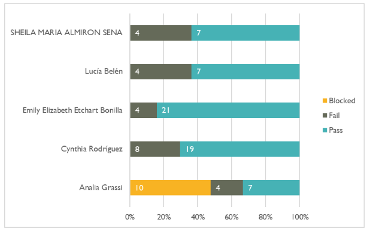

<h1>INFORME EJECUTIVO DE TESTING</h1>
  
   
   
  
Almirón, Sheila  
  Etchart, Emily   
  Grassi, Analía  
  Rodriguez, Cynthia 

   

  
 Testers  
  Jóvenes a Programar  
  26 de octubre de 2024

 

 <h2>ÍNDICE</h2> 
  <ol>
    <li><a href = "#introduccion">Introducción</a></li>
    <li><a href = "#alcance">Alcance</a></li>
    <li><a href = "#desarrollo">Desarrollo y resultados claves</a>
     
    <ol>
      <li><a href = "#autenticacion">Autenticación de usuario</a></li>
      <li><a href = "#registro_cliente">Registro de nuevo Cliente</a></li>
      <li><a href = "#registro_mascota">Registro de Mascotas</a>
       
      <ol>
        <li><a href = "#web">Versión Web</a></li>
        <li><a href = "#mobile">Versión Mobile</a></li>
      </ol></li>
      <li><a href = "#registro_vacunas">Registro de Vacunas</a></li>
      <li><a href = "#base">Base de Datos</a>
       
      <ol>
        <li><a href = "#tabla_mascotas">Tabla de Mascotas</a></li>
        <li><a href = "#tabla_usuarios">Tabla de Usuarios</a></li>
        <li><a href = "#tabla_clientes">Tabla de Clientes</a></li>
      </ol></li>
    </ol></li>
    <li><a href = "#datos">Datos y métricas</a></li>
    <li><a href = "#recomendaciones">Recomendaciones</a></li>
    <li><a href = "#conclusiones">Conclusiones</a></li>
  </ol>

 

  <h2>INTRODUCCIÓN</h2>
  
Este trabajo presenta los resultados del proceso de testing de las funcionalidades “Registro de Mascota”, “Registro de Cliente”, “Autenticación de Usuario” y “Registro de Vacunas” de la 
web de la Veterinaria Guau Guau durante el período de prueba que abarcó del 14/10/2024 al 26/10/2024. Además, se evaluó la integridad de la base de datos. El objetivo del testing fue evaluar la validación de datos, la compatibilidad y la usabilidad de la herramienta. 

 

  <h2 id = "alcance">ALCANCE</h2>
  
El proceso de testing abarcó una amplia variedad de enfoques y técnicas incluyendo:  

<strong>Pruebas de validación de datos:</strong> Se realizaron distintas pruebas que verifican que los datos ingresados cumplen con los requisitos especificados (como formato de correos electrónicos, contraseñas, etc).  

<strong>Técnicas de valores límites:</strong> Se probaron los valores límites para cada campo en los distintos formularios.  

<strong>Pruebas de enfoque negativo:</strong> Se sometió a las funcionalidades a escenarios de prueba negativos, ingresando registros con datos incorrectos para evaluar la resistencia a errores de usuario.  

<strong>Pruebas de enfoque positivo:</strong> Se realizaron pruebas para verificar que los distintos formularios funcionaran correctamente bajo condiciones normales, validando que los usuarios pudieran realizar acciones sin problemas.  

<strong>Pruebas de compatibilidad:</strong> En el formulario “Registro de Mascota” se realizaron pruebas en dispositivos diferentes para verificar que la sección funcione tanto en PC como en Teléfono móvil.  

<strong>Pruebas exploratorias:</strong> Se exploró el registro de Mascota para identificar posibles problemas y escenarios no documentados. Esto ayudó a descubrir áreas de mejora y a abordar situaciones inesperadas.  

Este trabajo no abarca pruebas de seguridad ni pruebas funcionales efectivamente ejecutadas en la Autenticación de Usuarios debido a que esta sección aún no ha sido desarrollada. Tampoco se incluyen pruebas exhaustivas en los requerimientos no funcionales como rendimiento, mantenimiento o escalabilidad ya que el sistema no se encuentra alojado en un servidor. 

 

  <h2>DESARROLLO Y RESULTADOS CLAVES</h2>
  

    <h3 id = "autenticacion">Autenticación de Usuario</h3>  
    En esta oportunidad no fue posible avanzar con la ejecución de las pruebas previamente detalladas, en el Plan de pruebas de Casos de Uso(Informe de Pruebas- Requerimiento funcionales RF01) debido a que la funcionalidad para el login no está desarrollada aún o se encuentra en proceso, y no fue proporcionada por el equipo de desarrollo. 
  

   
  

    <h3 id = "registro_cliente">Registro de nuevo cliente</h3> 
     
    <strong>Pruebas Funcionales:</strong> Todas las pruebas funcionales relacionadas con el registro de nuevos clientes en la aplicación Veterinaria Guau Guau se completaron de manera satisfactoria en su mayoría. El sistema permite registrar clientes, mostrando confirmación al finalizar el registro exitoso. Sin embargo, se detectaron fallos en algunos escenarios específicos, donde el sistema no mostró mensajes de error para datos inválidos en los campos de entrada. 
     
     
<strong>Validación de Datos:</strong> Se realizó una validación exhaustiva de los datos ingresados en el formulario de registro, verificando que el sistema detecte y gestione correctamente campos vacíos y formatos inválidos, como direcciones de correo electrónico incorrectas. La mayoría de los mensajes de error fueron adecuados, aunque se observaron casos donde datos inválidos en ciertos campos no fueron detectados correctamente, lo que permitió el registro incorrecto de clientes. 
      
     
<strong>Manejo de errores:</strong> Se comprobó que el sistema muestra mensajes de error claros cuando se omiten campos obligatorios o se ingresa un correo ya registrado. Sin embargo, en algunos casos de valores fuera de rango o con formatos no válidos, el sistema generó mensajes de éxito en lugar de error, lo que requiere ajuste. 
     
     
<strong>Hallazgos Adicionales:</strong> Durante el proceso de testing, se identificaron inconsistencias en la validación de ciertos datos no válidos, así como oportunidades de mejora en la claridad de algunos mensajes de confirmación y error. Se recomienda revisar la lógica de validación para asegurar que todos los datos ingresados sean gestionados adecuadamente. 
  

   
  

    <h3 id = "registro_mascota">Registro de Mascotas</h3>  
    <h4 id = "web">Versión Web</h4>  
    <strong>Pruebas de validación de datos:</strong> El 30% de las pruebas de validación de datos  se completaron satisfactoriamente.  El sistema no detecta valores límites, ni diferencia caracteres alfabéticos de alfanuméricos. 
     
     
    <strong> Prueba exploratoria:</strong> La interfaz de versión web funciona correctamente. Se adapta a la pantalla si el usuario se dispone a hacer zoom y no tiene problemas de usabilidad.
     
     
    <h4 id = "mobile">Versión Mobile</h4>
     
    <strong>Pruebas de validación de datos:</strong> El 35% de las pruebas de validación de datos se completaron satisfactoriamente. El sistema mobile presenta los mismos errores que su contraparte en Web. No detecta valores límites, ni diferencia caracteres alfabéticos de alfanuméricos. 
     
     
    <strong>Prueba exploratoria:</strong>  La interfaz de la versión mobile presenta varios problemas. No es responsive, por lo que si el usuario decide hacer zoom, éste no se adapta a la pantalla del dispositivo. Además, el logo de la empresa no carga y está dañado. Los botones “Cancelar” y “Registrar Vacunas” no se encuentran conectados a los respectivos formularios. Por lo tanto, al seleccionarlos, el usuario se encuentra con una pantalla de error. 
  

   
  

    <h3 id = "registro_vacunas">Registro de Vacunas</h3>
     
    <strong>Pruebas Funcionales:</strong> Las pruebas funcionales confirmaron que el sistema permite el ingreso correcto de datos válidos en el módulo de registro de vacunas, mostrando un mensaje de confirmación exitoso al usuario cuando se completan todos los campos requeridos de manera adecuada.
     
     
    <strong>Validación de Campos Obligatorios:</strong> Las pruebas demostraron que el sistema responde adecuadamente a la omisión de datos en campos obligatorios, generando mensajes de error claros cuando el usuario deja en blanco alguno de los campos requeridos, como Nombre, Dosis, Fecha de Aplicación o Fecha de Vencimiento.
     
     
     <strong>Validación de Datos Fuera de Rango:</strong> La mayoría de los datos fuera de los límites permitidos fueron rechazados correctamente. Sin embargo, se identificaron algunos fallos críticos en el tratamiento de datos inválidos:
    <ul>
      <li>Nombre con más de 100 caracteres: El sistema permitió el registro de nombres que exceden el límite de caracteres, lo cual debería ser rechazado y requiere corrección.</li>
      <li>Nombre con caracteres no alfanuméricos: El sistema permitió el registro de nombres que contienen caracteres especiales, lo cual no cumple con los requisitos y debe revisarse.</li>
      <li>Dosis fuera de rango: En algunos casos, el sistema permitió el registro de dosis no incluidas en las opciones válidas ("Primera", "Segunda" y "Tercera"), lo que indica una falla en la validación de este campo.</li>
      <li>Fecha de vencimiento anterior a la fecha de aplicación: Aunque se espera que el sistema rechace fechas de vencimiento que ocurren antes de la fecha de aplicación, en algunos casos, esta validación no se activó y el sistema permitió el registro incorrecto.</li>
    </ul>
   
  Estos fallos indican que es necesario revisar las validaciones en el sistema para evitar que datos fuera de los rangos permitidos sean aceptados durante el registro de vacunas.
  

   
  

    <h3 id = "base">Base de Datos</h3>
     
    <h4 id = "tabla_mascotas">Tabla Mascotas</h4>
     
    Para el módulo de registro de mascotas, se desarrollaron 11 casos de prueba con el fin de verificar la capacidad del sistema para gestionar la inserción de datos en diferentes escenarios, incluyendo validaciones de datos como el Nombre,Fecha de Nacimiento y Especie.
     
     
    Fue precondición necesaria que previamente estuviera ingresado un cliente para proceder a la visualización correcta de los datos. El cual se admite que se repita, debido a que un mismo cliente puede tener más de una mascota.
     
     
    <strong>Resumen de Resultados:</strong>
     
    <ul>
      <li>Total de Casos de Prueba: 11</li>
      <li>Casos Exitosos: 10 (6 casos favorables y 4 que arrojan errores)</li>
      <li>Casos Fallidos: 1</li>
    </ul>
     
     
    <strong>Análisis:</strong>
     
    De los 11 casos de prueba ejecutados, 10 fueron exitosos, cumpliendo con las expectativas tanto en las pruebas consideradas satisfactorias como en aquellas que se esperaba un mensaje de error, el cual se obtuvo correctamente. Sin embargo, se identificó un caso de prueba que no arrojó el resultado esperado.
     
     
    El caso de prueba fallido se relaciona con la validación de la fecha de nacimiento de la mascota, ya que el sistema no debería permitir ingresar una fecha futura como válida. Este hallazgo resalta la importancia de implementar validaciones adicionales en la base de datos para evitar este tipo de errores en el ingreso de datos.
     
     
    <h4 id = "tabla_usuarios">Tabla de Usuarios</h4>
     
    Se ejecutaron un total de 7 casos de prueba, diseñados para cubrir diversas combinaciones de entradas válidas e inválidas. Esto incluyó tanto la autenticación con credenciales correctas e incorrectas como la prueba de límites de tamaño en los campos NombreUsuario y Contrasenia.
     
     
    <strong>Resumen de Resultados:</strong>
     
    <ul>
      <li>Total de Casos de Prueba: 7</li>
      <li>Casos Exitosos: 6</li>
      <li>Casos Fallidos: 1</li>
    </ul>
     
     
    <strong>Análisis:</strong>
     
    Aunque la mayoría de los casos de autenticación resultaron exitosos, el caso CP07 falló debido a la longitud del campo NombreUsuario, que supera el límite de 50 caracteres. MySQL emitió una alerta y restringió la inserción a este límite, lo que indica que es necesario implementar validaciones adicionales para evitar intentos de inserción que excedan esta longitud.
     
     
    <h4 id = "tabla_clientes">Tabla de Clientes</h4>
     
    Para el módulo de registro de cliente, se desarrollaron 11 casos de prueba con el fin de verificar la capacidad del sistema para gestionar la inserción de datos en diferentes escenarios, incluyendo validaciones de correo electrónico y límites de campo.
     
     
    <strong>Resumen de Resultados:</strong>
     
    <ul>
      <li>Total de Casos de Prueba: 11</li>
      <li>Casos Exitosos: 7</li>
      <li>Casos Fallidos: 4</li>
    </ul>
     
     
    <strong>Análisis:</strong>
     
    Se identificaron 4 casos de prueba en los que el resultado no fue el esperado. Las pruebas fallidas están relacionadas con la validación de correos electrónicos incorrectos y entradas de datos con valores no permitidos. Estos resultados destacan la necesidad de aplicar validaciones adicionales en el formulario de registro para evitar registros no válidos.
     
     
    Casos específicos de fallos:
     
     
    <ul>
      <li>CP06: La inserción no valida el formato de correo electrónico.</li>
      <li>CP08: El campo Apellido permite caracteres numéricos.</li>
      <li>CP10: El campo Nombre permite caracteres numéricos.</li>
      <li>CP11: Supera la longitud de 50 caracteres en el campo Nombre, y aunque MySQL emite una alerta y limita el ingreso, es necesario un control para evitar este tipo de inserciones.</li>
    </ul>
  

 

  <h2>DATOS Y MÉTRICAS</h2>
  

  
   
   
  
   
   
  
   
   
  
   
   
  
   
   
  
  

 

  <h2>RECOMENDACIONES</h2>
   
  

  En base a los resultados obtenidos durante el proceso de testing se hacen las siguientes recomendaciones:
     
     
    Reforzar la validación de datos en los distintos formularios para proteger al sistema de los posibles errores de usuario, aplicando restricciones a los distintos campos. 
Se recomienda aplicar técnicas de valores límites, ya que se detectó que esta es la mayor debilidad del sistema hasta el momento.
   
   
  En referencia a la documentación del sistema, se solicita agregar en los anexos del ESRE especificaciones más exhaustivas de las distintas variables que maneja el sistema. Por ejemplo, en el “Registro de Vacunas” se puede especificar qué se entiende por Fecha de Aplicación. Si ésta hace referencia al momento en que hace el registro o si es el momento en el que esta se aplica al paciente. También es necesario detallar si es necesaria una restricción a la fecha de vencimiento de las vacunas, si es que esta fecha depende directamente del tipo de vacuna.
   
   
  Con respecto a la base de datos proporcionada, se sugiere adoptar un modelo que aporte mayor completitud.
Se sugiere una Tabla Usuarios que contenga tanto Clientes como Administradores. Los cuales compartirán atributos como Nombre y Apellido. 
Además, los Clientes estarán relacionados a una tabla Mascotas que tendrán como atributos el Nombre, la Fecha de Nacimiento y la Especie. Las especies sólo podrán ser Perro, Gato, Ave u Otro. Para facilitar una posible clasificación. 
Se recomienda tener una tabla Especie, para poder organizar las mascotas en distintas subtablas como Perro, Gato y Ave. 
Las mascotas reciben vacunas, y éstas se registrarán en la tabla Vacunas. Las cuales tendrán un número identificatorio, Nombre, Dosis (Primera, Segunda o Tercera), Fecha de Aplicación y Fecha de vencimiento.  
Por otro lado, el administrador registrará a los Clientes, sus mascotas y las vacunas que éstas tengan, en el sistema. 
Se propone este modelo preliminar para tener una base de datos más práctica, normalizada y poder facilitar al usuario su uso y análisis para la toma de decisiones informadas.
Con respecto a la base de datos proporcionada, se sugiere adoptar un modelo que aporte mayor completitud.
Se sugiere una Tabla Usuarios que contenga tanto Clientes como Administradores. Los cuales compartirán atributos como Nombre y Apellido. 
Además, los Clientes estarán relacionados a una tabla Mascotas que tendrán como atributos el Nombre, la Fecha de Nacimiento y la Especie. Las especies sólo podrán ser Perro, Gato, Ave u Otro. Para facilitar una posible clasificación. 
Se recomienda tener una tabla Especie, para poder organizar las mascotas en distintas subtablas como Perro, Gato y Ave. 
Las mascotas reciben vacunas, y éstas se registrarán en la tabla Vacunas. Las cuales tendrán un número identificatorio, Nombre, Dosis (Primera, Segunda o Tercera), Fecha de Aplicación y Fecha de vencimiento.  
Por otro lado, el administrador registrará a los Clientes, sus mascotas y las vacunas que éstas tengan, en el sistema. 
Se propone este modelo preliminar para tener una base de datos más práctica, normalizada y poder facilitar al usuario su uso y análisis para la toma de decisiones informadas.
  

  

 

  <h2>CONCLUSIONES</h2>
   
  En términos generales, se puede decir que el sistema aún se encuentra en una etapa preliminar. Si bien el 64% de las pruebas realizadas se completaron con éxito, las distintas secciones presentan problemas de validación de datos. Estos problemas pueden significar debilidades tanto en seguridad como en la integridad de la información. 
Además, pueden causar una mala experiencia de usuario reduciendo la confianza que tenga éste en el sistema. 
Problemas de validación en una etapa inicial, no solo dificulta el procesamiento de la información, sino que también puede implicar futuros costos de mantenimiento y corrección de errores. 
Por lo tanto, se considera que la validación de datos en el sistema de la Veterinaria Guau Guau es un problema esencial a resolver. 

 

  

