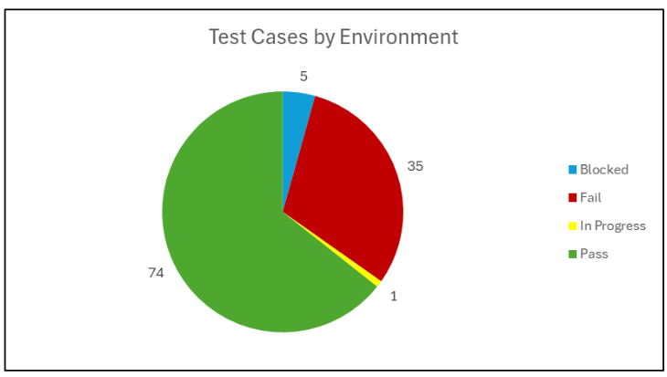
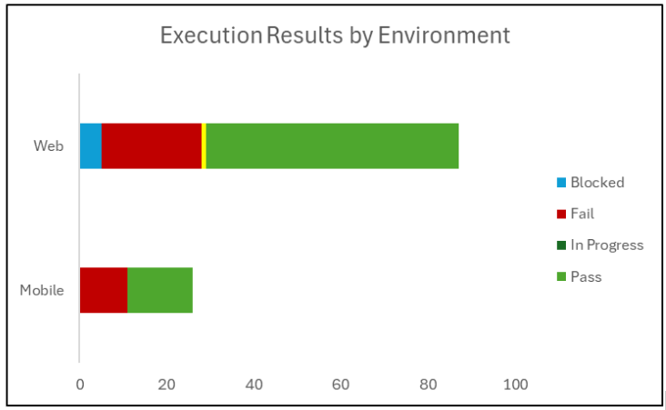
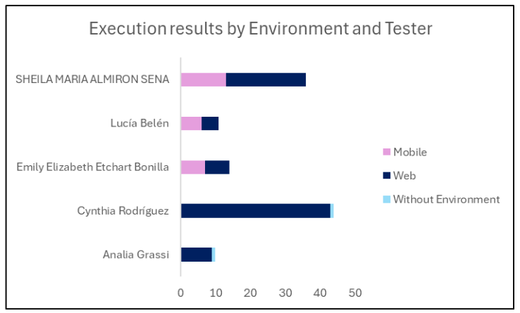
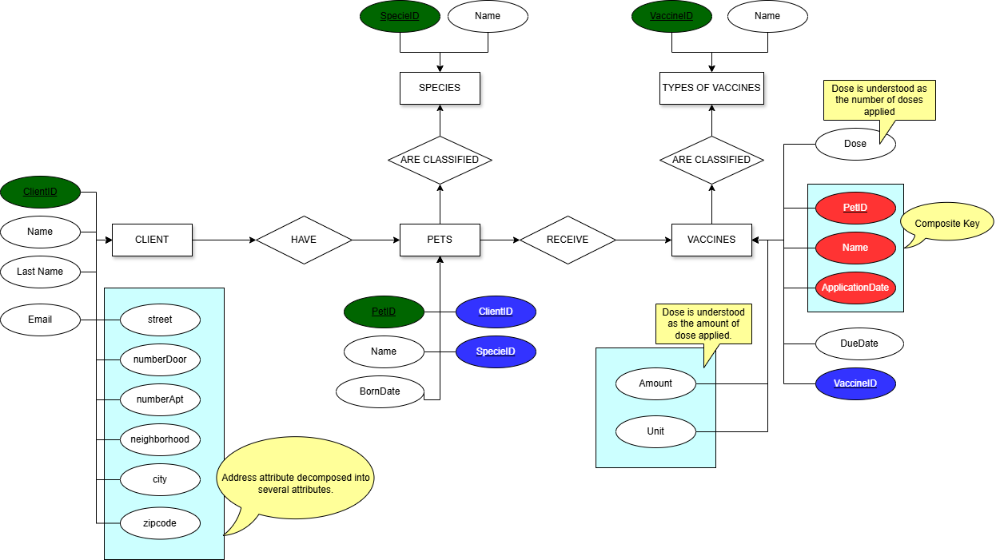

<h1>EXECUTIVE REPORT OF TESTING PROCESS</h1>
  

   
   

  Almirón, Sheila  
Etchart, Emily  
Grassi, Analía  
Peruza, Lucía  
Rodriguez, Cynthia  

 
 

  Testers  
Jóvenes a Programar  
November, 2024

 

  <h2>INDEX</h2>
  <ol>
    <li><a href = "#introduccion">Introduction</a></li>
    <li><a href = "#alcance">Scope</a></li>
    <li><a href = "desarrollo">Key results</a>
     
    <ol>
        <li><a href = "#autenticacion">User Authentication</a></li>
        <li><a href = "#registro_cliente">New Client Registration</a></li>
        <li><a href = "#registro_mascota">Pet Registration</a>
         
        <ol>
            <li><a href = "#version_web">Web Version</a></li>
            <li><a href = "#version_mobile">Mobile Version</a></li>
          </ol></li>
        <li><a href = "#registro_vacunas">Vaccines Register</a></li>
        <li><a href = "#database">Database</a></li>
        <li><a href = "#accesibilidad">Accessibility</a></li>
        <li><a href = "#compatibilidad">Compatibility and Usability</a></li>
      </ol></li>
    <li><a href = "#datos">Data and Metrics</a></li>
    <li><a href = "#recomendaciones">Recommendations</a></li>
    <li><a href = "#conclusiones">Conclusions</a></li>
  </ol>

 

  <h2>INTRODUCTION</h2>
   
  

This job presents the results of the testing process implemented on Veterinaria Guau Guau website during the period from 07/10/2024 to 10/11/2024. The team tested the functionalities Pet Register, Client Register, Vaccines Register, Login and Dashboard. Besides, the database integrity was assessed. The objectives were to evaluate data validation, accessibility, compatibility, usability and forms of normalization. 
  

 

  <h2>SCOPE</h2>
   
  

The testing process consisted of a wide variety of approaches and techniques including:
     
     
    <strong>Data validation tests:</strong> Various tests were carried out to verify that the data entered meets the specified requirements (such as email, passwords, etc).
     
     
    <strong>Limit values techniques:</strong> Limit values were tested for each field of the different forms.
     
     
    <strong>Negative focus tests:</strong> The functionalities were subjected to negative scenarios, entering records with incorrect data to evaluate resistance to user errors. 
     
     
    <strong>Positive focus tests:</strong> It implemented tests to evaluate that different forms work correctly above normal conditions, validating.
    
     
   <strong>Compatibility tests:</strong> Tests were carried out on different devices to verify that the sections work on both PC and Mobile. In addition, tests were applied in different browsers.
    
     
 <strong>Accessibility tests:</strong> Different tests were applied to verify that the website meets the WCAG standards defining accessibility. The four principles were considered: Perceivable, Operable, Adaptable, and Robust. 
   
     
    <strong>Usability tests:</strong> The different sections were explored from the user’s point of view in accordance with the ISO 25010 standard. 
     
     
   <strong> Exploratory testing:</strong> The different sections were explored to identify potential issues and undocumented scenarios, helping to reveal areas for improvement and address unexpected situations. 
     
     
  <strong>  Pruebas de confirmación:</strong> Se hizo trabajo de retesting para verificar que las incidencias reportadas fueron efectivamente solucionadas.
     
     
  <strong>Confirmation tests:</strong>Retesting was performed to verify that the reported issues were effectively resolved. 
     
     
    <strong>Regression tests:</strong>Regression tests were performed to verify that the solutions applied by the development team did not cause new incidents. 
     
     
    This work does not include exhaustive tests on non-functional requirements such as performance, maintenance or scalability because the system is not hosted on a server.
  

 

  <h2>KEY RESULTS</h2>
   
  <h3 id = "autenticacion">User Authentication</h3>
  
In this opportunity 10 test cases of data validation which were blocked on the previous instance were executed.  It used the credentials provided by the development team, alternating tests to try the accessibility and limitations. 
   
   
  <h4>User Authentication, login:</h4>
   
   
  Of the 10 test cases executed, 5 were successful, meeting client expectations both in the tests considered satisfactory and in those in which an error message was expected, which was obtained correctly. 
   
   
  Test cases were executed, detailed in test plan report RF01, through which the correct functioning of the login was verified. The system doesn’t allow empty fields and it gives an error alert. In addition, only pre-set data is allowed to be entered. 
   
   
  It is possible to continue using the website's functionalities if the user accesses it correctly. 
   
   
  On the other hand, 5 test cases were found blocked due to the impossibility  of executing tests for the client role, since the necessary data for proper access was not available.
  

  <h4>Mobile system:</h4>
  

   An exploratory session was made, with 5 minutes of duration where it saw the correct website’s functioning achieving pre-set tests in the different test reports and it obtained expected results.   
    In general terms, the system operates under similar conditions both on mobile devices and the web. As a general comment, it can be said that in the tests carried out, the website logo could not be displayed. This suggests difficulties in loading the image. 
  

  <h4>Exploratory session on web, Firefox browser:</h4>
  

   An exploratory session lasting 15 minutes was held to view the functionality, usability and interface of the website. It was inserted data into login, client register, pets register and vaccines register to verify the correctly functioning of each form. 
   
   
    The system works correctly overall, the website looks good, the logo can be seen and it’s possible to zoom on the screen. The scroll bar works fine. The buttons comply with the usability and functionality characteristics, allowing access to client register, pets and vaccines registers and correct data entry. 
 
 
Another observation about the website is that when registering clients, pets or vaccines, the system is not intuitive because it redirects to the home page. This forces data entry again. However, when clicking on an unlabeled button, the system allows continuing with a pet or vaccine register. 
  

  <h4>Exploratory session on web, Opera GX browser:</h4>
  

   An exploratory session was made using the Opera GX browser which duration was between 10 and 15 minutes. In this session functionality, usability and the interface of the website were investigated. Different tests with valid or invalid data were executed into login, client, pets and vaccines registers to verify the correctly functioning of these.
   
   
  In general terms, the system works fine. Although with some limitations, the website looks good. For example, the logo can’t be appreciated correctly and the scroll bar doesn't work as expected. The buttons comply with the usability and functionality characteristics, allowing access to client, pets and vaccines registers and correct data entry. 
     
     
    Previous observation is maintained that the system redirects to the home page forcing data entry over and over again.
  

  <h3 id = "registro_cliente">New Client Registration</h3>
  

   Functional tests: In the retesting of functional tests related to the registration of new clients in the Veterinaria Guau Guau application, most tests failed. Although the system allows client registration and provides appropriate confirmation in some cases of successful registration, failures were detected in 9 specific scenarios. In this case, the system did not show error messages when invalid data was entered into input fields, allowing incorrect client registrations, which impacts the integrity of the data.
 
 
Regression tests: Of the regression tests executed, those that were successful in previous stages maintained their positive status. However, several regression tests failed to pass this new stage as defects related to invalid data persist.  
 
 
Confirmation tests: Confirmation tests were conducted to verify the resolution of previously reported issues. These tests revealed that the issues persist, particularly in the validation of input data in the name and surname fields. These problems continue to impact the system by adjustments are still needed to ensure accurate and effective validation. 
 
 
Data validation: A thorough validation of the data entered in the registration form was conducted, verifying that the system correctly detects and handles empty fields and invalid formats. Most error messages were appropriate; however, cases were observed where invalid data in these fields was not correctly detected, allowing the incorrect registration of clients.   
   
   
Error handling: It was verified that the system provides clear error messages when mandatory fields are omitted. Nonetheless, in some cases of out-of-range or invalid formats, the system generated success messages instead of errors, which requires adjustment. 
   
   
Additional findings:
During the retesting process, inconsistencies were identified in the validation of invalid data in certain fields, as well as opportunities to improve the clarity of some confirmation and error messages. It is recommended to review and strengthen the validation logic to ensure that all entered data is correctly verified and handled, preventing incorrect client registrations. 
  

<h3 id = "registro_mascota">Registro de Mascotas</h3>
  <h4 id = "version_web">Versión Web</h4>
  

  La versión web mostró mejoras en la funcionalidad del campo de especie, aunque persisten algunos problemas menores de usabilidad:
    <ul>
      <li>Campo de Especie en Lista Desplegable: La lista desplegable permitió registrar correctamente las mascotas en categorías predeterminadas y mostrar especies no comunes con la opción “Otro”, mejorando la precisión de los registros.</li>
      <li>Errores en Validación de Otros Campos: Persisten algunos errores en la validación de datos en otros campos, sin bloquear el flujo de registro, pero afectando la integridad de los datos.</li>
      <li>Compatibilidad en Navegadores Secundarios: Se observaron diferencias en la visualización de elementos en Firefox y Safari, lo que podría mejorar para asegurar consistencia visual.</li>
    </ul>
   
  Pruebas de validación de datos: El 73% de las pruebas de validación de datos  se completaron satisfactoriamente.  Pero se estima que el otro 27% de las funcionalidades del sistema no detecta valores límites, ni diferencia caracteres alfabéticos de alfanuméricos. 
   
   
  Prueba exploratoria: La interfaz de versión web funciona correctamente. Se adapta a la pantalla si el usuario se dispone a hacer zoom y no tiene problemas de usabilidad.
  

  <h4 id = "version_mobile">Versión Mobile</h4>
  

   En la versión mobile, se observaron mejoras similares, aunque algunos problemas de visualización y usabilidad persisten:
    <ul>
      <li>Campo de Especie: La lista desplegable funcionó correctamente, permitiendo la selección de especies no comunes y registrando exitosamente en la lista de mascotas del cliente.</li>
      <li>Problemas de Visibilidad y Accesibilidad: La interfaz no se ajustó adecuadamente en todos los dispositivos móviles, afectando la navegación y la facilidad de uso en pantallas pequeñas.</li>
    </ul>
  Pruebas de validación de datos: El 35% de las pruebas de validación de datos se completaron satisfactoriamente. El sistema mobile presenta los mismos errores que su contraparte en Web. No detecta valores límites, ni diferencia caracteres alfabéticos de alfanuméricos. 
   
   
 Prueba exploratoria: La interfaz de la versión mobile presenta varios problemas. No es responsive, por lo que si el usuario decide hacer zoom, éste no se adapta a la pantalla del dispositivo. Además, el logo de la empresa no carga y está dañado. Los botones de “Cancelar” y “Registrar Vacunas” ahora si se encuentran conectados a los respectivos formularios. Por lo tanto, cumplen su función al ejecutarlos. 
  

  <h3 id = "registro_vacunas">Registro de Vacunas</h3>
  

    <ul>
      <li>Pruebas Funcionales: Las pruebas funcionales confirmaron que el sistema permite el ingreso correcto de datos válidos en el módulo de registro de vacunas, mostrando un mensaje de confirmación exitoso al usuario cuando se completan todos los campos requeridos de manera adecuada.</li>
       <li>Validación de Campos Obligatorios: Las pruebas demostraron que el sistema responde adecuadamente a la omisión de datos en campos obligatorios, generando mensajes de error claros cuando el usuario deja en blanco alguno de los campos requeridos, como Nombre, Dosis, Fecha de Aplicación o Fecha de Vencimiento.</li>
       <li>Validación de Datos Fuera de Rango: La mayoría de los datos fuera de los límites permitidos fueron rechazados correctamente. Sin embargo, se identificaron algunos fallos críticos en el tratamiento de datos inválidos:
 
<ul>
  <li>Nombre con más de 100 caracteres: El sistema permitió el registro de nombres que exceden el límite de caracteres, lo cual debería ser rechazado y requiere corrección.</li>
  <li>Nombre con caracteres no alfanuméricos: El sistema permitió el registro de nombres que contienen caracteres especiales, lo cual no cumple con los requisitos y debe revisarse.</li>
  <li>Fecha de vencimiento anterior a la fecha de aplicación: Aunque se espera que el sistema rechace fechas de vencimiento que ocurren antes de la fecha de aplicación, en algunos casos, esta validación no se activó y el sistema permitió el registro incorrecto.</li>
</ul>
</li>
    </ul>
  Estos fallos indican que es necesario revisar las validaciones en el sistema para evitar que datos fuera de los rangos permitidos sean aceptados durante el registro de vacunas.
  

 

  <h2>Base de Datos</h2>
  

  La base de datos de la veterinaria Guau Guau está compuesta por tres entidades CLIENTE, MASCOTA y VACUNA. Todas ellas presentan oportunidades de mejoras o tienen alguna limitación con respecto a las formas de normalización.
<ol>
  <li>La tabla CLIENTES presenta una posibilidad de mejora en el atributo Dirección, ya que este no se encuentra normalizado.
     
Esto permite:  
    <ul>
      <li>Realizar búsquedas o filtros más específicos. Por ejemplo, buscar clientes por ciudad o barrio.</li>
      <li>Colocar restricciones más específicas. Por ejemplo, que el numeroPuerta deba ser un número entero de hasta 4 dígitos.</li>
      <li>Aplicar cambios con mayor facilidad. Es posible realizar cambios en los distintos campos sin la necesidad de hacerlo para toda una cadena de dirección.</li>
    </ul>
</li>
  <li>Con respecto a la tabla MASCOTAS, se detectaron dos posibles mejoras en el atributo Especie:  
    <ul>
      <li>Utilizar una restricción CHECK para estandarizar los datos y evitar errores o variaciones innecesarias en la información. Por ejemplo, se evitarían inconsistencias como “perro”, “Perro”, “PERRO” para la misma especie. 
Esto brinda un mejoramiento en la calidad en la validación de datos y minimiza la posibilidad de errores humanos al ingresar especies no válidas. Por  último, la restricción CHECK permite facilidad de mantenimiento, ya que, si se necesita agregar más especies, solo basta con actualizar dicha restricción.</li>
      <li>Crear una tabla de referencia llamada ESPECIES. Esta tabla enlista las especies válidas. Luego se puede establecer una clave foránea en la tabla MASCOTAS que apunte a la tabla ESPECIES. 
Esto permite gestionar y actualizar las especies válidas de forma más sencilla.
</li>
    </ul>
  </li>
  <li>En la tabla VACUNAS se detectaron otras potenciales mejoras:
 
    <ul>
      <li>Con respecto al atributo Dosis se entiende que es necesaria una mejor clarificación.
</li>
      <li>Con respecto a los atributos Fecha Aplicación y Fecha Vencimiento, se sugiere agregar una restricción CHECK para asegurar que Fecha Vencimiento sea posterior a Fecha Aplicación. Esto evitaría errores en los registros de fechas. 
</li>
      <li>Otra posible sugerencia de mejora es crear una tabla de TIPOS_DE_VACUNAS con dos campos: Nombre y VacunaID. Luego, esta tabla puede ser referenciada en la tabla VACUNAS a través de una llave foránea. Esto puede resultar útil para estandarizar las vacunas en un solo lugar.</li>
      <li>Por último, se sugiere como mejora establecer una clave única compuesta por Mascota ID, Nombre y Fecha Aplicacion para evitar que se registre la misma vacuna para una mascota en la misma fecha. 
</li>
    </ul>
  </li>
</ol>  
  

 

  <h2>Accesibilidad</h2>
  

    El 64% de las pruebas realizadas para verificar la accesibilidad del sitio resultaron ser exitosas.  
Si bien esto puede percibirse como un sitio con una buena noticia para los usuarios con discapacidades visuales o motrices, aún queda mucho por mejorar en este aspecto. 
  

 

  <h2>Compatibilidad y Usabilidad</h2>
  

    Se realizaron 14 pruebas para verificar la compatibilidad y usabilidad del sitio web de la Veterinaria Guau Guau. 
El 86% de estas pruebas fueron ejecutadas con éxito. El 14% de las pruebas resultaron fallidas y todas éstas se concentraron en la parte móvil.
Todas las pruebas ejecutadas en distintos navegadores del entorno web resultaron exitosas. A partir de esto, se puede inferir que el sitio no presenta problemas de compatibilidad ni usabilidad en navegadores web. Sin embargo, estos problemas surgen en el entorno móvil, lo que sugiere que el desarrollo actual de las funcionalidades no está enfocado en estos usuarios.
  

 

  <h2>DATOS Y MÉTRICAS</h2>
  

  
  

  

    El 64% de las pruebas realizadas por el equipo resultaron ser exitosas.  
Mientras que el 36% no pudieron ser completadas satisfactoriamente, ya sea porque fallaron o porque quedaron con estado “bloqueado”.
  

 
  

    
  

  

    La mayoría de las pruebas fueron ejecutadas en Web. Tanto en Chrome, como en otros navegadores como Opera GX, Microsoft Edge, Firefox, etc.
  

 
  

    
  

  

    Todos los Testers del equipo aplicaron pruebas en el sitio web utilizando como entorno la web.  
Dos miembros se enfocaron en web durante esta etapa del trabajo, mientras que el resto trabajó tanto en web como en mobile. 
  

 

  <h2>RECOMENDACIONES</h2>
  

    En base a los resultados obtenidos durante el proceso de testing se hacen las siguientes recomendaciones:  

Reforzar la validación de datos en los distintos formularios para proteger al sistema de los posibles errores de usuario, aplicando restricciones a los distintos campos. 
Se recomienda aplicar técnicas de valores límites, ya que este continúa siendo la mayor debilidad del sistema.   

Para mejorar la compatibilidad del sitio se sugiere aplicar responsive design, para que éste se adapte a las distintas resoluciones de pantalla. También vuelve adaptables los elementos que lo componen, como las tablas en la sección “Dashboard”, ya que éstas se “salen” del formulario cuando contienen datos muy extensos.  

Con respecto a la usabilidad del sitio, se recomienda agregar al “Dashboard” una tabla de Clientes para poder gestionarlos desde la administración. Si se necesita “dar de baja” un cliente, el sistema no permite realizar esta acción. Tampoco se visualiza a qué cliente corresponde qué mascota debido a la ausencia de una tabla. 
Por último, para mejorar la usabilidad y la experiencia de usuario, se recomienda que el sistema permita “editar” mascotas y vacunas con el fin de actualizar o corregir información ya existente. 
En cuanto a la interfaz, se recomienda el uso de mensajes más descriptivos y reubicar algunos botones (como la casilla de registrar mascota en el formulario Registro de Cliente).  

En cuanto a la accesibilidad del sitio, se sugiere adoptar algunas medidas para mejorar la experiencia de los usuarios con discapacidades. Estas medidas se basan en las normas WCAG y son por ejemplo:
 
<ul>
  <li>Mejora en la navegación por teclado. El contenido principal no está señalizado y esto obliga al usuario a recorrer toda la página para poder encontrarlo.</li>
  <li>Agregar botones de ayuda o más información.</li>
  <li>Agregar al código atributos ARIA para mejorar la experiencia de usuarios no videntes o con discapacidades visuales. Sin estos atributos las tecnologías de asistencia no reconocen correctamente los mensajes. 
</li>
  <li>Cambiar el título de la página “Sistemas de Gestión de Clientes y Mascotas - Veterinaria XYZ” por el título “Sistemas de Gestión de Clientes y Mascotas - Guau Guau Veterinaria”. Esto permite que los usuarios no videntes puedan reconocer la empresa a través de la tecnología de asistencia. Un nombre de empresa incorrecto puede traer confusión y frustración. 
</li>
</ul>
 
En referencia a la documentación del sistema, se solicita agregar en los anexos del ESRE especificaciones más exhaustivas de las distintas variables que maneja el sistema. Por ejemplo, en el “Registro de Vacunas” se puede especificar qué se entiende por Dosis. Si se está haciendo referencia a la cantidad de dosis aplicada en la mascota (por ejemplo 0.5 mg) o si hace referencia al número de dosis aplicada en la mascota (por ejemplo primera o segunda dosis).  

Con respecto a la base de datos proporcionada, se sugiere adoptar un modelo que aporte mayor completitud que incluya las sugerencias aportadas en el informe técnico.  

Se muestra en el modelo las dos posibles formas de representar el atributo Dosis. Como un atributo único en el caso de que se entienda como el número de dosis aplicada. Como dos atributos distintos en caso de entenderla como la cantidad de dosis aplicada.  

  

  

 

  <h2>CONCLUSIONES</h2>
  <h3>Validación de datos
</h3>
  

    En términos generales, se puede decir que el sistema aún se encuentra con limitaciones. Si bien la mayoría de las pruebas realizadas se completaron con éxito, el 36% de las pruebas fallidas se relacionan a problemas de validación de datos y de usabilidad. Estos problemas pueden significar debilidades tanto en seguridad (inyecciones SQL por ejemplo) como en la integridad de la información (por ejemplo ingreso de información incompleta o datos erróneos).  
Además, pueden causar una mala experiencia de usuario reduciendo la confianza que tenga éste en el sistema reduciendo su disposición a utilizarlo. 
Problemas de validación en una etapa inicial, no solo dificulta el procesamiento de la información, sino que también puede implicar futuros costos de mantenimiento y corrección de errores. 

  

  <h3>Usabilidad</h3>
  

    En cuanto a la interfaz, se puede inferir que aplicar las sugerencias de mejora que aparecen en este informe (como agregar una tabla de gestión de clientes en la sección Dashboard) mejoraría la usabilidad de la herramienta. 

  

  <h3>Accesibilidad</h3>
  

    Por último, si bien la mayoría de las pruebas de accesibilidad fueron exitosas, el sitio aún carece de características importantes que incluyan a los usuarios de tecnologías de asistencia, como el uso de botones de ayuda o una buena configuración de alto contraste. 
  

  <h3>Conclusión final</h3>
  

    Por lo tanto, se concluye que la validación de datos sigue siendo el principal problema del sitio web de la veterinaria y desde el equipo se cree que éste debe ser atendido como prioridad. Una posible solución es agregar criterios de aceptación de datos en cada campo de los distintos formularios. Además, se sugiere reforzar la integridad de los datos permitiendo al usuario releer, corregir y confirmar los datos antes de registrar un nuevo cliente, mascota o vacuna. Esto permitirá optimizar la experiencia del usuario y reducir el riesgo de errores en futuras interacciones con el sistema.
 
 
Este informe resume los resultados clave del proceso de retesting. Si tienes alguna pregunta o necesitas información adicional, no dudes en contactarnos.

  

  

  

