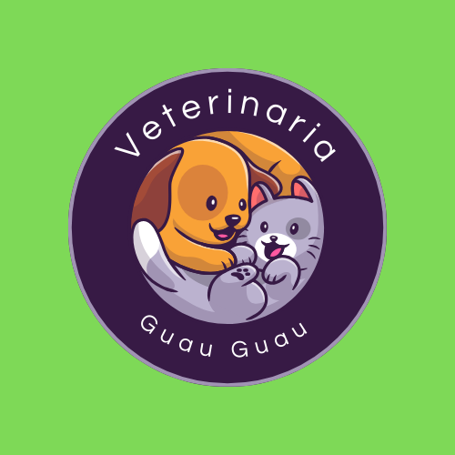

<h1>EXECUTIVE REPORT OF TESTING PROCESS</h1>
  

   
   

  Almirón, Sheila  
Etchart, Emily  
Grassi, Analía  
Peruza, Lucía  
Rodriguez, Cynthia  

 
 

  Testers  
Jóvenes a Programar  
November, 2024

 

  <h2>INDEX</h2>
  <ol>
    <li><a href = "#introduccion">Introduction</a></li>
    <li><a href = "#alcance">Scope</a></li>
    <li><a href = "desarrollo">Key results</a>
     
    <ol>
        <li><a href = "#autenticacion">User Authentication</a></li>
        <li><a href = "#registro_cliente">New Client Registration</a></li>
        <li><a href = "#registro_mascota">Pet Registration</a>
         
        <ol>
            <li><a href = "#version_web">Web Version</a></li>
            <li><a href = "#version_mobile">Mobile Version</a></li>
          </ol></li>
        <li><a href = "#registro_vacunas">Vaccines Register</a></li>
        <li><a href = "#database">Database</a></li>
        <li><a href = "#accesibilidad">Accessibility</a></li>
        <li><a href = "#compatibilidad">Compatibility and Usability</a></li>
      </ol></li>
    <li><a href = "#datos">Data and Metrics</a></li>
    <li><a href = "#recomendaciones">Recommendations</a></li>
    <li><a href = "#conclusiones">Conclusions</a></li>
  </ol>

 

  <h2>INTRODUCTION</h2>
   
  

This job presents the results of the testing process implemented on Veterinaria Guau Guau website during the period from 07/10/2024 to 10/11/2024. The team tested the functionalities Pet Register, Client Register, Vaccines Register, Login and Dashboard. Besides, the database integrity was assessed. The objectives were to evaluate data validation, accessibility, compatibility, usability and forms of normalization. 
  

 

  <h2>SCOPE</h2>
   
  

The testing process consisted of a wide variety of approaches and techniques including:
     
     
    <strong>Data validation tests:</strong> Various tests were carried out to verify that the data entered meets the specified requirements (such as email, passwords, etc).
     
     
    <strong>Limit values techniques:</strong> Limit values were tested for each field of the different forms.
     
     
    <strong>Negative focus tests:</strong> The functionalities were subjected to negative scenarios, entering records with incorrect data to evaluate resistance to user errors. 
     
     
    <strong>Positive focus tests:</strong> It implemented tests to evaluate that different forms work correctly above normal conditions, validating.
    
     
   <strong>Compatibility tests:</strong> Tests were carried out on different devices to verify that the sections work on both PC and Mobile. In addition, tests were applied in different browsers.
    
     
 <strong>Accessibility tests:</strong> Different tests were applied to verify that the website meets the WCAG standards defining accessibility. The four principles were considered: Perceivable, Operable, Adaptable, and Robust. 
   
     
    <strong>Usability tests:</strong> The different sections were explored from the user’s point of view in accordance with the ISO 25010 standard. 
     
     
   <strong> Exploratory testing:</strong> The different sections were explored to identify potential issues and undocumented scenarios, helping to reveal areas for improvement and address unexpected situations. 
     
     
  <strong>  Pruebas de confirmación:</strong> Se hizo trabajo de retesting para verificar que las incidencias reportadas fueron efectivamente solucionadas.
     
     
  <strong>Confirmation tests:</strong> Retesting was performed to verify that the reported issues were effectively resolved. 
     
     
    <strong>Regression tests:</strong> Regression tests were performed to verify that the solutions applied by the development team did not cause new incidents. 
     
     
    This work does not include exhaustive tests on non-functional requirements such as performance, maintenance or scalability because the system is not hosted on a server.
  

 

  <h2>KEY RESULTS</h2>
   
  <h3 id = "autenticacion">User Authentication</h3>
  
In this opportunity 10 test cases of data validation which were blocked on the previous instance were executed.  It used the credentials provided by the development team, alternating tests to try the accessibility and limitations. 
   
   
  <h4>User Authentication, login:</h4>
   
   
  Of the 10 test cases executed, 5 were successful, meeting client expectations both in the tests considered satisfactory and in those in which an error message was expected, which was obtained correctly. 
   
   
  Test cases were executed, detailed in test plan report RF01, through which the correct functioning of the login was verified. The system doesn’t allow empty fields and it gives an error alert. In addition, only pre-set data is allowed to be entered. 
   
   
  It is possible to continue using the website's functionalities if the user accesses it correctly. 
   
   
  On the other hand, 5 test cases were found blocked due to the impossibility  of executing tests for the client role, since the necessary data for proper access was not available.
  

  <h4>Mobile system:</h4>
  

   An exploratory session was made, with 5 minutes of duration where it saw the correct website’s functioning achieving pre-set tests in the different test reports and it obtained expected results.   
    In general terms, the system operates under similar conditions both on mobile devices and the web. As a general comment, it can be said that in the tests carried out, the website logo could not be displayed. This suggests difficulties in loading the image. 
  

  <h4>Exploratory session on web, Firefox browser:</h4>
  

   An exploratory session lasting 15 minutes was held to view the functionality, usability and interface of the website. It was inserted data into login, client register, pets register and vaccines register to verify the correctly functioning of each form. 
   
   
    The system works correctly overall, the website looks good, the logo can be seen and it’s possible to zoom on the screen. The scroll bar works fine. The buttons comply with the usability and functionality characteristics, allowing access to client register, pets and vaccines registers and correct data entry. 
 
 
Another observation about the website is that when registering clients, pets or vaccines, the system is not intuitive because it redirects to the home page. This forces data entry again. However, when clicking on an unlabeled button, the system allows continuing with a pet or vaccine register. 
  

  <h4>Exploratory session on web, Opera GX browser:</h4>
  

   An exploratory session was made using the Opera GX browser which duration was between 10 and 15 minutes. In this session functionality, usability and the interface of the website were investigated. Different tests with valid or invalid data were executed into login, client, pets and vaccines registers to verify the correctly functioning of these.
   
   
  In general terms, the system works fine. Although with some limitations, the website looks good. For example, the logo can’t be appreciated correctly and the scroll bar doesn't work as expected. The buttons comply with the usability and functionality characteristics, allowing access to client, pets and vaccines registers and correct data entry. 
     
     
    Previous observation is maintained that the system redirects to the home page forcing data entry over and over again.
  

  <h3 id = "registro_cliente">New Client Registration</h3>
  

   Functional tests: In the retesting of functional tests related to the registration of new clients in the Veterinaria Guau Guau application, most tests failed. Although the system allows client registration and provides appropriate confirmation in some cases of successful registration, failures were detected in 9 specific scenarios. In this case, the system did not show error messages when invalid data was entered into input fields, allowing incorrect client registrations, which impacts the integrity of the data.
 
 
Regression tests: Of the regression tests executed, those that were successful in previous stages maintained their positive status. However, several regression tests failed to pass this new stage as defects related to invalid data persist.  
 
 
Confirmation tests: Confirmation tests were conducted to verify the resolution of previously reported issues. These tests revealed that the issues persist, particularly in the validation of input data in the name and surname fields. These problems continue to impact the system by adjustments are still needed to ensure accurate and effective validation. 
 
 
Data validation: A thorough validation of the data entered in the registration form was conducted, verifying that the system correctly detects and handles empty fields and invalid formats. Most error messages were appropriate; however, cases were observed where invalid data in these fields was not correctly detected, allowing the incorrect registration of clients.   
   
   
Error handling: It was verified that the system provides clear error messages when mandatory fields are omitted. Nonetheless, in some cases of out-of-range or invalid formats, the system generated success messages instead of errors, which requires adjustment. 
   
   
Additional findings:
During the retesting process, inconsistencies were identified in the validation of invalid data in certain fields, as well as opportunities to improve the clarity of some confirmation and error messages. It is recommended to review and strengthen the validation logic to ensure that all entered data is correctly verified and handled, preventing incorrect client registrations. 
  

<h3 id = "registro_mascota">Pet Registration</h3>
  <h4 id = "version_web">Web Version </h4>
  

  The web version showed improvements in the functionality of the species field, although some minor usability issues persist:
    <ul>
      <li>Species field - Dropdown list: The dropdown list allowed the correct registration of pets in predefined categories and included uncommon species through the ‘Other’ option, enhancing the accuracy of the records. </li>
      <li>Errors in Validation of Other fields: Some errors persist in the validation of data in other fields, which do not block the registration flow but impact data integrity. </li>
      <li>Compatibility in Secondary browsers: Differences were observed in the rendering of elements in Firefox and Safari, which should be improved to ensure visual consistency. </li>
    </ul>
   
  Data validation tests: 73% of the data validation tests were completed successfully. However, it is estimated that the remaining 27% of the system’s functionalities do not detect limit values nor differentiate between alphabetic and alphanumeric characters.  
   
   
  Exploratory session: The web version interface operates correctly. It adjusts to the screen when the user zooms in, with no usability issues. 
  

  <h4 id = "version_mobile">Mobile Version</h4>
  

   In the mobile version, similar improvements were observed, although some display and usability issues persist:
    <ul>
      <li>Species field: The dropdown list worked correctly, allowing the selection of uncommon species and successfully registering them in the client’s pet list. </li>
      <li>Visibility and Accessibility issues: The interface did not adjust properly on all mobile devices, affecting navigation and ease of use on smaller screens. </li>
    </ul>
  Data validation tests: 35% of the data validation tests were completed successfully. The mobile system presents the same errors as its web counterpart. It does not limit values, nor does it differentiate between alphabetic and alphanumeric characters. 
   
   
Exploratory session: The mobile version interface presents several issues. It is not responsive, so if the user decides to zoom, it does not adjust to the device’s screen. Additionally, the company logo does not load and is damaged. The “Cancel” and “Register Vaccines” buttons are now correctly linked to their respective forms, and therefore, they function as expected when clicked. 
  

  <h3 id = "registro_vacunas">Vaccines Register</h3>
  

    <ul>
      <li>Functional tests: Functional tests confirmed that the system allows the correct entry of valid data in the vaccine registration module, showing a successful confirmation message to the user when all required fields are properly completed. </li>
       <li>Mandatory field validation: The tests demonstrated that the system behaves correctly when data is omitted from mandatory fields, generating clear error messages when the user leaves any required fields blank, such as Name, Dose, Application Date, or Expiration Date. </li>
       <li>Out-of-range data validation: Most data outside the allowed limits was correctly rejected. However, some critical failures were identified in the handling of invalid data:
 
<ul>
  <li>Name with more than 100 characters: The system allowed the registration of names exceeding the character limit, which should have been rejected and requires correction.</li>
  <li>Name with non-alphanumeric characters: The system allowed the registration of names containing special characters, which does not comply with the requirements and should be reviewed.</li>
  <li>Expiration date before Application date: Although the system is expected to reject dates that occur before the application date, in some cases, this validation did not trigger, and the system allowed incorrect registration. </li>
</ul>
</li>
    </ul>
  These failures indicate that the system validations need to be reviewed to prevent data outside the allowed ranges from being accepted during vaccine registration. 
  

 

  <h2>Database</h2>
  

  The Veterinaria Guau Guau database is made up of three entities: Client, Pet and Vaccine.  
All of them present opportunities for improvement or have some limitations with normalization forms.
<ol>
  <li>Clients table present an opportunity of improvement in the Address attribute because it is not normalized.
     
This allow:   
    <ul>
      <li>Perform more specific searches or filters. For example, search clients by city or neighborhood.</li>
      <li>Setting more specific restrictions. For example, numberDoor must be an integer up to 4 digits.</li>
      <li>Applying changes easily. </li>
    </ul>
</li>
  <li>Regarding the Pets table, two potential improvements were detected in the Specie attribute.  
    <ul>
      <li>Add a CHECK restriction to standardize the data and avoid mistakes unnecessary on the information. For example, it would avoid inconsistencies as “dog”, “Dog”, “DOG” for the same specie.   
This gives a quality improvement in data validation and minimizes the possibility of human errors when entering invalid species. 
          
At last, CHECK restriction allows maintenance easily because if it is necessary add more species just would be enough to update the restriction.</li>
      <li>Create a reference table called Species. This table contains valid species. Then a foreign key can be set on the pets table that points toward Species table. This allows managing and updating valid species in an easy way. 
</li>
    </ul>
  </li>
  <li>In the Vaccines table others potential improvements were found:
 
    <ul>
      <li>Regarding the Dose attribute, a better clarification is necessary.
</li>
      <li>Regarding the attributes of ApplicationDate and DueDate, it is suggested add a CHECK restriction to ensure that DueDate to be later than ApplicationDate.  
This would avoid errors on the date records. 
</li>
      <li>Another potential improvement is create a types of vaccines table with two fields: Name and VaccineID. Then, this table it can be reference through a foreing key on the vaccines table. This would be useful to standardize vaccines in a single place. </li>
      <li>At last, set a unique composite key for petID, name and ApplicationDate. This is suggested as an improvement to avoid entering the same vaccines for a pet at the same date. 
</li>
    </ul>
  </li>
</ol>  
  

 

  <h2>Accessibility</h2>
  

    64% of the tests conducted to verify the site’s accessibility were successful.  
While this may be seen as good news for users with visual or motor disabilities, there is still much to improve in this regard. 
  

 

  <h2>Compatibility and Usability</h2>
  

    14 tests were conducted to verify the compatibility and usability of the Veterinaria Guau Guau website.   
86% of these tests were successfully executed. 14% of the tests failed, and all of these were concentrated in the mobile version. 
 
All tests conducted in different web browsers were successful. Based on this, it can be inferred that the site does not present compatibility or usability issues in web browsers. However, these issues arise in the mobile environment, suggesting that the current development of functionalities is not focused on these users. 

 

  <h2>DATA and METRICS</h2>
  

  
  

  

    64% of the tests performed by the team were successful, while 36% could not be completed successfully, either because they failed or remained in a “blocked” status.
  

 
  

    
  

  

    Most of the tests were run on Web. Using Google Chrome and other browsers like Opera GX, Microsoft Edge, Firefox, etc.
  

 
  

    
  

  

All testers on the team applied tests on the website using the web as the environment.   
Two members focused on web during this stage of the work, while the rest worked on both web and mobile. 
  

 

  <h2>RECOMMENDATIONS</h2>
  

Based on the results obtained during the testing process, the following recommendations are made:
   

Reinforce data validation in the different forms to protect the system from potential user errors by applying restrictions to the different fields. 
It is recommended to implement boundary value techniques as this remains the system’s greatest weakness.   

To improve the site’s compatibility it is suggested to apply responsive design so it can adapt to different screen resolutions. This would also make the elements that compose it more adaptable, such as the tables in the “Dashboard” section, since these currently “overflow” the form when containing extensive data.  

Regarding site usability it is recommended to add a “Clients” table to the “Dashboard” to allow client management from the admin panel. If the admin needs to “cancel” a client the system does not allow this action. It is also not possible to visualize which client corresponds to which pet due to the absence of a table.  
Lastly, to improve usability and user experience, it is recommended that the system allows “editing” pets and vaccines to update or correct existing information.  
Regarding the interface, it is suggested to use more descriptive messages and relocate some buttons (such as the “Register Pet”  field on the Client Registration form).
  

In terms of the site accessibility, the following measures are suggested to improve the experience for the users with disabilities, based on WCAG standards: 
 
<ul>
  <li>Improved keyboard navigation. The main content is not marked, forcing users to navigate through the entire page to find it.</li>
  <li>Add “help” or “more information” buttons.</li>
  <li>Include ARIA attributes in the code to improve the experience for blind or visually impaired users. Without these attributes, assistive technologies cannot correctly interpret messages.
</li>
  <li>Change the page title from "Client and Pet Management System - Veterinaria XYZ" to "Client and Pet Management System - Guau Guau Veterinaria." This allows visually impaired users to recognize the company through assistive technology. An incorrect company name may cause confusion and frustration.  
</li>
</ul>
 
Regarding system documentation, it is requested to include more detailed specifications in the ESRE annexes for the various variables used by the system. For example, in the "Vaccine Registration" it could specify what is meant by "Dose". Whether it is referring to the amount of dose administered to the pet (e.g. 0.5 mg), or whether it refers to the number of doses administered (e.g. first or second dose).  

For the provided database, it is suggested to adopt a more complete model that incorporates the recommendations made in the technical report.
 

The model shows two possible ways to represent the "Dose" attribute.
As a single attribute if it refers to the number of doses administered.
As two different attributes if it refers to the amount of dose administered. 
 

  

  

 

  <h2>CONCLUSIONS</h2>
  <h3>Data validation</h3>
  

   In general, it can be said that the system still has significant limitations. While the majority of tests were successfully completed, 36% of the failed tests were related to issues with data validation and usability. These problems could pose risks to both security (e.g. SQL injections) and information integrity (e.g. incomplete or incorrect data entry).
  
In addition, such issues may lead to a poor user experience, reducing user trust in the system and their willingness to use it.
 
Data validation problems at an early stage not only hinder the processing of information but can also result in future maintenance and error correction costs.
  

  <h3>Usability</h3>
  

    Regarding the interface, it can be inferred that implementing the improvement suggestions outlined in this report (such as adding a client management table in the Dashboard section) would enhance the usability of the tool.
  

  <h3>Accessibility</h3>
  

Lastly, although most accessibility tests were successful, the site still lacks important features that would make it inclusive for users of assistive technologies, such as help buttons or proper high-contrast configurations.
  

  <h3>Final conclusion</h3>
  

It is concluded that data validation remains the primary issue with the veterinary website, and the team believes it should be addressed as a priority. A possible solution would be to add data acceptance criteria for each field in the different forms.
     
Additionally, it is suggested to reinforce data integrity by allowing users to review, correct, and confirm their input before registering a new client, pet, or vaccine. This would optimize the user experience and reduce the risk of errors in future interactions with the system.
 
 
This report summarizes the key results of the retesting process. If you have any questions or need additional information, please feel free to contact us.

  

  

  

